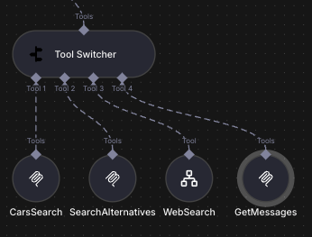

# n8n-nodes-tool-switcher

**Tool Switcher** is an n8n community node that dynamically selects which AI tools to provide to an Agent based on configurable rules. Unlike a simple switch, it evaluates **all** rules and returns **all** tools whose conditions are satisfied — giving your AI Agent exactly the right set of capabilities for each situation.



---

## How It Works

Tool Switcher accepts between 2 and 10 tool inputs. For each input you define one or more **rules** — each rule pairs a tool with a set of conditions (using n8n's built-in filter with `AND`/`OR` combinators).

At runtime, the node:

1. Iterates through every rule in order.
2. Evaluates the rule's conditions against the current item's data.
3. Collects the tool if its conditions are met.
4. Returns **all** collected tools as an array to the connected AI Agent.

> **Key difference from Model Selector:** Model Selector evaluates rules and returns the **first** matching model. Tool Switcher evaluates **all** rules and returns **every** tool whose conditions are met. This means multiple tools can be active simultaneously, giving the Agent a dynamic, context-aware toolset.

---

## Installation

### Via n8n UI (recommended)

1. Open your n8n instance.
2. Go to **Settings → Community Nodes**.
3. Click **Install a community node**.
4. Enter the package name:

   ```
   n8n-nodes-tool-switcher
   ```

5. Click **Install** and restart n8n when prompted.

### Via npm (self-hosted)

```bash
npm install n8n-nodes-tool-switcher
```

Then restart your n8n instance.

---

## Usage

### Step-by-step

1. **Add the node** — search for *Tool Switcher* in the node panel and drag it into your workflow.
2. **Set the number of inputs** — use the *Number of Inputs* parameter to choose how many tool slots you need (2–10).
3. **Connect tools** — attach any n8n AI tool nodes (e.g., Calculator, HTTP Request, Code) to the Tool Switcher's input connectors.
4. **Configure rules** — click *Add Rule* for each tool you want to conditionally include:
   - Select the **Tool** input slot from the dropdown.
   - Define **Conditions** using n8n's filter UI (supports string, number, boolean comparisons with `AND`/`OR` logic).
5. **Connect the output** — wire the *Tools* output to the **Tools** input of an AI Agent node.

The Agent will receive only the tools whose conditions were satisfied for the current item.

---

## Configuration

| Parameter | Type | Default | Description |
|-----------|------|---------|-------------|
| **Number of Inputs** | Number | `2` | How many tool input connectors to expose (2–10). |
| **Rules** | Fixed Collection | — | One or more rules. Each rule contains a **Tool** selector and a **Conditions** filter. All rules are evaluated; all matching tools are returned. |

### Rule fields

| Field | Description |
|-------|-------------|
| **Tool** | Selects which input slot (Tool 1 … Tool N) this rule applies to. |
| **Conditions** | A filter expression (supports `AND`/`OR`, all n8n data types). The tool is included when the expression evaluates to `true`. |

---

## Comparison with Model Selector

| Feature | Model Selector | Tool Switcher |
|---------|---------------|---------------|
| Output type | AI Model | AI Tool(s) |
| Number of outputs | **One** (first match) | **All** matching |
| Rule evaluation | Stops at first match | Evaluates every rule |
| Use case | Pick the right LLM | Pick the right set of tools |
| Multiple simultaneous results | No | Yes |

Use **Model Selector** when you need to route to a single language model.  
Use **Tool Switcher** when you need to give an Agent a dynamic, multi-tool arsenal based on runtime conditions.

---

## License

MIT © 2026 [Elijah Zobenko](mailto:ilya@zobenko.ru)

See the [LICENSE](LICENSE) file for full terms.

---

## Links

- **Repository:** <https://github.com/he110/n8n-nodes-tool-switcher>
- **npm:** <https://www.npmjs.com/package/n8n-nodes-tool-switcher>
- **n8n Community Nodes docs:** <https://docs.n8n.io/integrations/community-nodes/>
